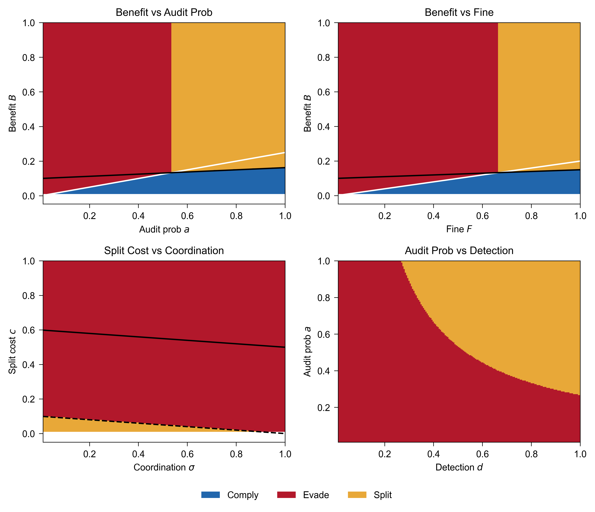
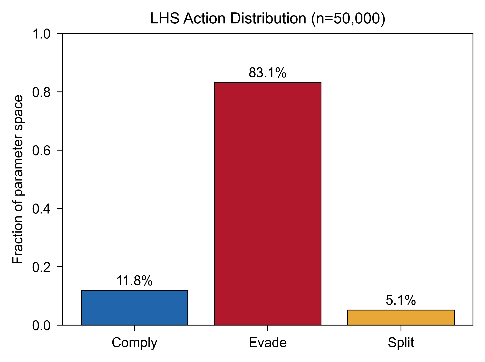
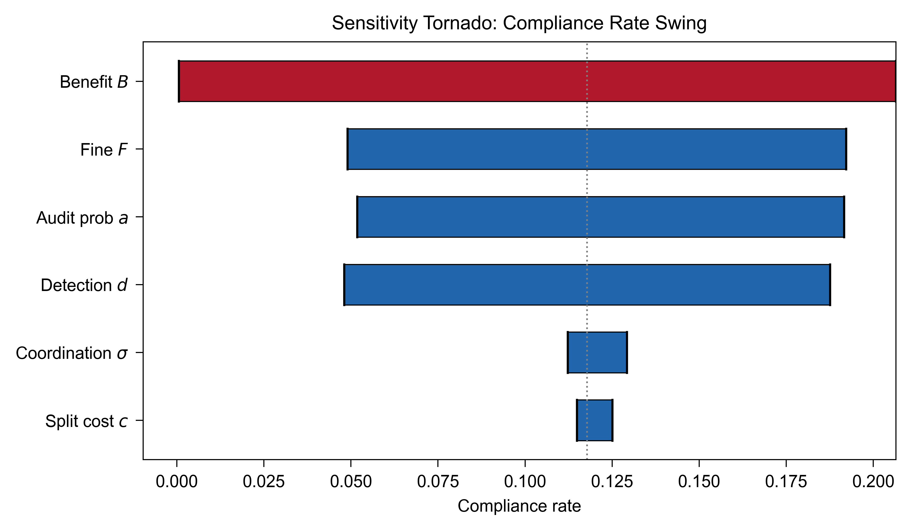
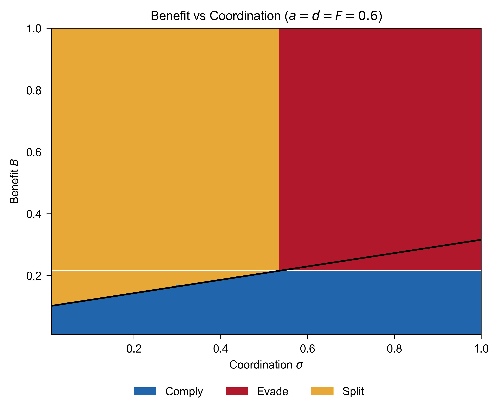

# SplitComp

This project asks a simple question: if an AI lab is rational and only cares about profit, when does it comply with compute governance rules?

The answer, at least in this model, is almost never. Under pure deterrence with uniform parameter draws, only 11.8% of the parameter space yields compliance. The other 88.2% favors cheating. That gap between what the model predicts and what we actually observe in real enforcement regimes (Calel et al. found 98.8% compliance in the EU ETS) tells us that deterrence alone is not doing the heavy lifting. Reputation, repeated interactions, and risk aversion probably are.

The model extends Becker's (1968) rational crime framework with a third action: instead of just {comply, evade}, a lab can also split its training run across data centers in different countries to stay below each jurisdiction's reporting threshold. This adds two new parameters: the cost of splitting (c) and international regulatory coordination (sigma).



## What the code does

`splitcomp.ipynb` runs three analyses on the model:

**2D heatmaps** vary two parameters at a time while holding the rest at baseline. They show where the comply/evade/split boundaries fall.

**Latin hypercube sampling** draws 50,000 points uniformly across all six parameters and classifies each one. This is where the 11.8% / 83.1% / 5.1% numbers come from.



**Sensitivity analysis** moves each parameter from 0.2 to 0.8 one at a time and measures the compliance rate swing. B (benefit of cheating) produces the largest swing at roughly 20 percentage points. Audit rate, detection, and fine each produce 13-14 pp. Coordination and split cost are under 2 pp.



## The split finding

Under weak enforcement, splitting barely matters because there is not enough enforcement pressure to justify the overhead. But under strong enforcement (a = d = F = 0.6), a wedge opens up: labs that would otherwise comply choose to split their compute across jurisdictions when international coordination is low. The boundary sits at sigma = 0.54. Below that, splitting is cheaper than getting caught. A regulator that raises audit rates and fines without also building cross-border information sharing may push labs into splitting rather than into compliance.



## The model

```
U(comply) = 0
U(evade)  = B - a * d * F
U(split)  = B - c - a * d * sigma * F
```

| Parameter | What it is |
|-----------|------------|
| B | How much a lab gains from an undisclosed model |
| a | How often regulators audit |
| d | Probability of catching a violation given an audit |
| F | How large the penalty is |
| c | Extra cost of splitting compute across countries |
| sigma | How well regulators share information across borders |

All parameters are in [0, 1]. The lab picks whichever action pays the most.

## What the model does not do

This is a one-shot game with a risk-neutral lab. There is no repeated play, no reputation, no intrinsic motivation, and no dynamic regulator. All labs are identical; there is no heterogeneity in firm size, risk tolerance, or profit motive. All six parameters are independent. The baseline values are assumptions with no empirical grounding in AI governance because no such data exists yet. The 11.8% compliance prediction is a property of the model under uniform priors, not a prediction about real-world AI labs.

## License

MIT
